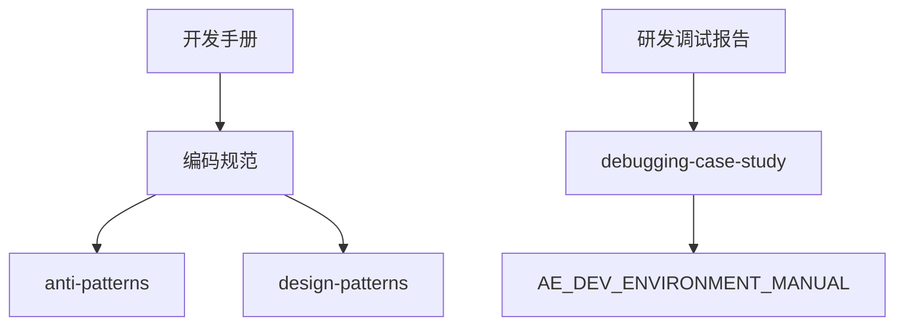

# 开发文档

AE 插件开发的核心参考文档。

## 核心文档

- [[开发手册]] — AE 插件开发完整手册（架构、目录结构、技术决策）
- [[用户手册]] — 最终用户操作指南（安装、4 大功能模块使用）
- [[编码规范]] — 强制编码规范（ES3/ES5 语法限制、禁用 API、命名约定）
- [[研发调试报告]] — 闭环调试报告（10 个确认根因、7 个诊断脚本）
- [[debugging-case-study]] — 调试案例深度分析（5 步调试法实战演示）
- [[超级开发工作流-SKILL]] — 结构化开发方法论（7 阶段）

## 文档关系

- [[编码规范]] 定义了规则 → [[anti-patterns]] 展示了违规案例
- [[研发调试报告]] 记录了方法 → [[debugging-case-study]] 是实战演练
- [[开发手册]] 是技术总览 → 更深入的细节在各 Phase 报告中

## 关键约束速查

| 层级 | 语法限制 |
|------|---------|
| ExtendScript | ES3：禁用 const/let/箭头/class/模板字符串/Promise |
| CEP Panel JS | ES5：禁用 const/let/箭头/class/fetch |
| Python | FastAPI + ONNX 模型 |

禁止使用的 API：`app.refresh`、`layer.selected`、同步 `system.callSystem`（长操作）、`confirm()`（CEP 中不可用）

---

> 返回 → [[🏠-AE知识中心]]
