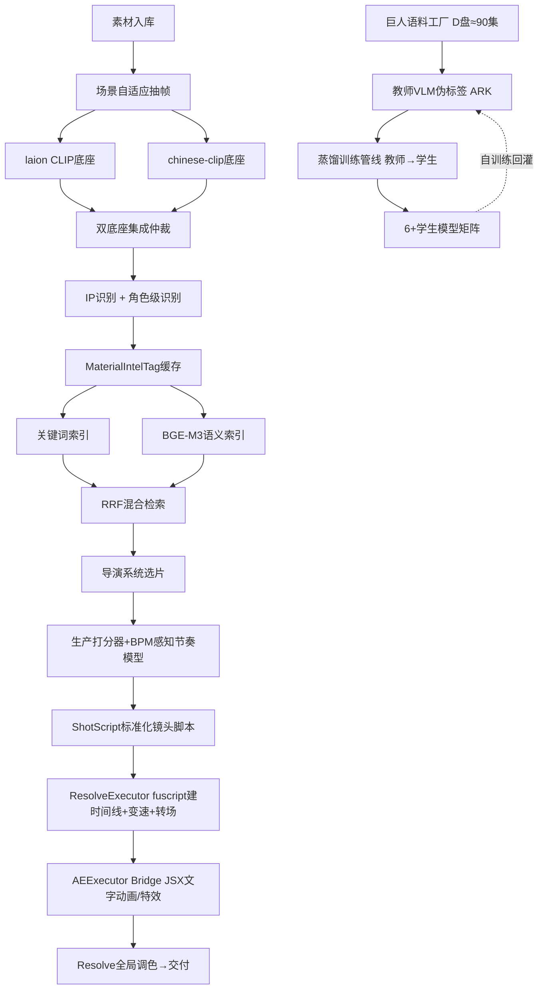

# P4 素材智能化进化方案（监督升级版）

> **日期**: 2026-08-06 | **前置文档**: `00-每日记录/2026-08-06_P0-P3素材智能化全阶段交付-新会话交接文档.md`
> **定位**: P0–P3 已交付"眼睛+记忆+审美"，本方案是其后的系统化进化计划。六条主线：评测基础设施、双底座集成架构、防泄漏训练协议、混合检索、**下游执行闭环（分析结果与镜头脚本直达 Resolve/AE）**、**大规模训练（进击的巨人语料+蒸馏+自训练飞轮）**。
> **授权声明（用户2026-08-06）**: 全流程自动化、无需人工点击；视频素材可自行下载；开放所有权限、允许任何手段完成任务；鼓励多多训练模型，学习业界大模型训练方法，允许蒸馏。
> **监督核验结论（本会话实测）**: 证据文件12项全在盘、38缓存/37素材齐备、`ip_proto_classifier` 常量与文档一致、`--accept` 复现 **12/12（legacy 5/12）** 通过、KB构建实测 **17.7s**（盲区6坐实）。D盘语料实测在位（见M6）。

## 零、前提与资源（管线落地前提）

| 资源 | 位置/状态 | 用途 |
|---|---|---|
| 进击的巨人全剧集 | `D:\夸克\` 下 S1/S2/S3/Final Season/OADs 五套 1080p（约90集） | M6大规模训练语料（角色识别/镜头边界/IP主力数据） |
| Resolve执行层 | `integrations/resolve_engine.py`（ResolveAutomationEngine：create_project/import_media/create_timeline_with_media/set_speed/apply_cdl/apply_lut等已就绪） | M5镜头脚本直达达芬奇 |
| AE执行层 | AE Bridge（executeAtomScript + JSX，自动监听器机制已有） | M5文字动画/特效合成段直达AE |
| 教师VLM | ARK Seed-1.6-Vision（端点t2lst） | 蒸馏教师/伪标签源 |
| 混合管线铁律 | Resolve粗剪+变速 → AE合成 → Resolve调色 → 交付（已验证流程，勿改顺序） | M5编排遵循 |

### 工具链盘点（2026-08-06实测定稿，无需再采购）

| 类别 | 已就位 | 位置/版本 |
|---|---|---|
| 训练框架 | torch 2.5.1+cu121 / torchvision / peft 0.20（LoRA）/ transformers 5.14 | RTX 4060 Laptop 8GB；peft/transformers装在`D:\ai-pkgs\site-packages`（.pth自动注册，勿删`Lib/site-packages/d_ai_pkgs.pth`） |
| 检索/嵌入 | sentence-transformers 5.7（BGE-M3用）、open_clip、modelscope | 同上 |
| 视觉工具 | cv2 / scenedetect（T19/T4直接用）/ insightface（T22人脸裁剪）/ onnxruntime | 同上 |
| 音频 | librosa / ffmpeg `C:\ffmpeg\bin` | — |
| 模型缓存 | `HF_HOME=D:\hf_cache`、`MODELSCOPE_CACHE=D:\ms_cache`（setx已持久化，新权重不再占C盘）；存量权重在项目`models/ms_cache`（laion CLIP + dinov2-small，后者可直接当T21特征蒸馏骨干） | D盘 |
| 执行层 | Resolve fuscript引擎 / AE Bridge / ARK密钥(.env.doubao) / ModelScope key(.env) | — |
| 结论 | **无需再从开源项目额外获取工具**；T19-T25全部依赖已覆盖 | — |

---

## 一、总目标与北极星指标

| 指标 | 现状 | P4目标 | 说明 |
|---|---|---|---|
| 库外IP真命中率（新C段口径） | 0/7（全是诚实拒绝） | **≥5/7** | LoRA+中文底座后"认出"FATE/海贼王等 |
| legacy口径 | 5/12 | **≥9/12**（扩样后折算≥38/50） | 与交接文档对齐 |
| 检索跨措辞召回 | 关键词匹配（换说法即失败） | 同义查询Top5召回 **≥80%** | "飙滑板"→"竞速"类查询 |
| KB冷启动 | 17.7s | **≤1s**（磁盘缓存命中） | 生产调用性能门 |
| 打分器验收 | 16/22 + 15/22 | **≥19/22 + ≥18/22** | 攻高密度踩点与无节拍BGM |
| 黄金集 | 12条 | **50条**（分层+双标） | 所有验收的统计地基 |
| 角色级查询 | 无 | `character=`过滤可用 | "搜利威尔的镜头" |
| 镜头脚本→Resolve/AE | 无自动化执行器 | **全自动零点击执行** | ShotScript直达达芬奇建时间线/AE合成 |
| 训练语料 | 3580教师帧 | **≥5万自动标注帧** | 巨人语料工厂+教师VLM伪标签 |
| 模型矩阵 | 1个CLIP kNN分类器 | **≥6个蒸馏学生模型** | 师生蒸馏+自训练飞轮，对标业界KD方法 |

**铁律（继承交接文档，勿改）**:
- `ip_matches` 空关键词恒True的legacy语义
- 仲裁链三规则与置信度上限（印证0.9 / 补位0.75）
- `detect_beats` 后必须接 `refine_beats_with_onsets`
- `build_from_library` 必须传 `intel_cache_dir="cache/material_intel"`
- PowerShell 用 `;` 不用 `&&`，Python 一律 `$env:PYTHONIOENCODING="utf-8"`

---

## 二、架构演进（目标态）



新增抽象层 **BackboneRegistry**：底座（laion/chinese-clip/LoRA版）可插拔、可并存集成，禁止硬替换单底座——双底座加权投票比单底座更稳，且保留回退路径。

---

## 三、任务分解（4个里程碑，14项任务）

### M1 地基：评测基础设施与数据（最高优先级，一切验收的前提）

| ID | 任务 | 做法要点 | 验收标准 |
|---|---|---|---|
| T1 | 黄金集扩样 12→50 | 分层抽样：A可学≥15 / B空金≥10 / C库外≥20（7个库外IP全覆盖，每IP≥2条）；每条双人工标注，**Cohen's Kappa≥0.8**才入库；存 `data/benchmark_golden_v2.json`，旧集保留作回归基线 | 50条入库；报告含Kappa值 |
| T2 | 评测框架统一 | 新建 `ai/accept_runner.py`：一条命令跑全部验收（P2.2/打分器/e2e），自动存档 `reports/accept_{date}.json`；关键指标算 **bootstrap 95% CI**（n=1000） | `python -m ai.accept_runner` 单命令出全量报告 |
| T3 | KB磁盘缓存 | 帧嵌入按 `{素材hash}_{backbone}.npz` 落盘 `cache/clip_embs/`，素材mtime+模型版本双键失效 | KB构建冷启动17.7s→**≤1s**（命中态） |
| T4 | 场景自适应抽帧 | ffmpeg scene检测切镜头→每镜头按时长比例抽帧（替换均匀12帧），直接复用P1.2的ip_timeline分段结果 | 4-IP混剪样本每IP至少1帧入选；旧均匀抽帧保留为fallback |

### M2 识别能力升级（攻盲区1：库外IP从"拒绝"变"真认出"）

| ID | 任务 | 做法要点 | 验收标准 |
|---|---|---|---|
| T5 | chinese-clip底座并行接入 | `OFA-Sys/chinese-clip-vit-base-patch16` 走 ModelScope `model_file_download` 通道（已验证）；接入BackboneRegistry，与laion并存 | 双底座各自在黄金集v2出分；集成≥max(单底座) |
| T6 | 双底座集成仲裁 | 分数级加权融合（权重在黄金集v2上网格搜索），接入现有仲裁链三规则（上限语义不变） | 集成后A段不降分；C段拒绝误报率下降 |
| T7 | CLIP LoRA对比学习微调 | 训练源=3580教师帧（24类）；**硬负例挖掘**（Top-k混淆类对，如火影↔咒术回战）；**防泄漏协议**：黄金集IP帧禁入训练集（继承坑4教训）；LoRA秩8-16，仅训attention投影矩阵 | 新C段口径库外真命中**≥5/7**；legacy折算≥9/12；A段无回退 |
| T8 | 教师数据增补 | 7个库外IP各用VLM教师补标50-100帧（走ARK端点t2lst），清洗协议继承坑13（英文歌名误关联检查） | 3580帧→≥4200帧，类别≥31 |

### M3 语义层：角色识别与向量检索（攻盲区2/3/4）

| ID | 任务 | 做法要点 | 验收标准 |
|---|---|---|---|
| T9 | 角色级原型库 | 教师VLM标"帧→角色"二级数据集（先覆盖利威尔/索隆/五条悟等高频角色）→CLIP角色原型；face区域裁剪可选增强 | `character=利威尔`检索Top10精确率≥70% |
| T10 | frame_semantic_index接入character过滤 | ShotUnit增加character字段；`search_text(query, character=...)` API | e2e脚本演示按角色捞镜头 |
| T11 | BGE-M3语义检索 | `BAAI/bge-m3`（ModelScope有托管）对镜头description+query双向量索引；**混合检索**=关键词分+向量分 RRF融合（reciprocal rank fusion, k=60），不废弃关键词通道 | 20条跨措辞查询（"飙滑板"类）Top5召回≥80%；原精确查询不回退 |
| T12 | mood/scene_type本地兜底 | CLIP帧嵌入上训轻量MLP头（mood 5类/scene_type 6类），训练标签从现有VLM缓存蒸馏；仲裁链新增规则4：VLM缺席→本地头补位（置信上限**0.6**，低于KB补位） | VLM缺席时两字段非空率100% |

### M4 审美与节奏精修 + 集成（攻盲区7）

| ID | 任务 | 做法要点 | 验收标准 |
|---|---|---|---|
| T13 | 打分器密度归一化+BPM感知 | ①切点密度归一化：按"切点数/节拍数"对能量分做惩罚项，根治高密度AMV随机碰运气（盲区7）；②特征加BPM分档+曲风（重拍权重）；训练集308→≥500样本 | 22素材验收 **≥19/22 + ≥18/22**；旧22样本无回退 |
| T14 | 导演系统集成+端到端验收 | `multimodal_director`选片链接入新检索与角色过滤；镜头美学分（可选：LAION-Aesthetics回归头，若时间不足降级为对比度/清晰度启发式）作同IP内择优；跑3条真实AMV生产案例 | 3案例PASS；交接文档v2更新；全部指标进accept_runner |

### M5 下游执行闭环（分析结果与镜头脚本直达 Resolve/AE，全自动零点击）

| ID | 任务 | 做法要点 | 验收标准 |
|---|---|---|---|
| T15 | ShotScript标准协议 | 定义`ShotScript` JSON schema：每镜头={source_video, in_tc/out_tc, speed_curve, transition, mood, characters[], text_overlay(文案/字体/动画预设), cdl/lut意图}；由`multimodal_director`产出，人可读可回放 | schema定稿+校验器（`ai/shot_script.py`）；旧e2e结果可序列化为ShotScript |
| T16 | ResolveExecutor | ShotScript→`ResolveAutomationEngine`：自动启动Resolve（无则拉起）→create_project→import_media（只导入脚本引用的素材）→create_timeline_with_media→set_speed/apply_speed_curve→转场→apply_cdl/lut；失败重试+断点续跑；全程fuscript无需人工 | 空机跑通：给定ShotScript自动产出带变速时间线；Resolve未启动时自动拉起 |
| T17 | AEExecutor | ShotScript的text_overlay段→AE Bridge：自动启动监听器→executeAtomScript建合成/文字层/动画预设；产物回写ShotScript供Resolve回套（混合管线铁律顺序） | AE未启动时自动拉起监听；文字层按脚本落位 |
| T18 | 端到端零点击生产 | 一条命令`python -m ai.auto_produce --bgm X --theme Y`：检索选片→导演编排→ShotScript→Resolve→AE→回Resolve调色→渲染交付；每步失败自动恢复或降级（如AE缺席→文字段降级Resolve标题） | 进击的巨人主题90s AMV从命令到成片**零人工点击**；交付mp4在output目录 |

### M6 大规模训练：巨人语料工厂 + 蒸馏 + 自训练飞轮（对标业界大模型训练方法）

| ID | 任务 | 做法要点 | 验收标准 |
|---|---|---|---|
| T19 | 巨人语料工厂 | D盘≈90集自动扫描→ffmpeg scene切镜头（镜头边界检测）→每镜头抽关键帧，目标**≥5万帧**；落盘`data/aot_corpus/frames/`+元数据json（集数/时间码/镜头号）；断点续传+hash去重 | 5万帧落盘且元数据完整；磁盘占用预估先行核验 |
| T20 | 教师伪标签管线 | ARK Seed-1.6批量标注（每镜头1-3帧）：IP/角色/mood/scene_type/描述；置信度字段+双轮一致性过滤；成本门控：分批夜跑+全量缓存+失败重入 | ≥5万帧伪标签；高置信（双轮一致）占比≥70% |
| T21 | 蒸馏训练管线（KD） | 教师→学生三通道蒸馏：①**logit蒸馏**（教师软标签温度T=4）训角色/mood分类头；②**特征蒸馏**（教师描述→BGE/CLIP文本空间对齐）；③**自蒸馏**（Mean Teacher：学生EMA教师产伪标签）；参考Data2Vec/CLIP蒸馏实践，全部离线CUDA | 学生模型在黄金集v2上≥教师90%能力，推理速度≥10倍 |
| T22 | 角色级大规模训练 | 巨人角色专攻：艾伦/利威尔/三笠/阿尔敏/韩吉/埃尔文/兵长等≥10主角；教师标帧→对比学习+人脸区域裁剪增强；并入T9角色原型库（巨人角色天然海量单IP样本） | `character=利威尔` Top10精确率≥80%（巨人域内） |
| T23 | LoRA大规模重训 | T7的LoRA微调用语料从3580帧升级到≥5万帧（巨人+库内全量）；课程学习：先易类后混淆类 | 库内IP识别A段无回退；巨人域识别≥95% |
| T24 | 自训练飞轮 | 学生推理全库→高置信伪标签回灌训练集→再训→验收，自动迭代（每轮accept_runner出分，连续2轮不涨自动停）；全部过程脚本化无人值守 | ≥2轮自动迭代完成；每轮指标不降；过程日志可回放 |
| T25 | 模型矩阵封装 | 6+学生模型统一注册`ai/model_registry.py`：IP识别/角色识别/mood分类/scene分类/美学分/镜头边界检测；统一predict接口+版本管理+回滚 | `python -m ai.model_registry --list`列出全部模型与验收分 |

---

## 四、执行顺序与依赖

```
M1(T1→T2; T3,T4并行) → M2(T8→T5→T6→T7)
T19巨人语料工厂从M1起并行启动(纯工程无依赖)，产出喂给：T20→T21/T22/T23→T24→T25
M3(T9→T10, T11, T12并行) → M4(T13→T14) → M5(T15→T16/T17并行→T18)
```

- **T1/T2是硬前置**：没有50条黄金集，所有模型验收都不可信。
- **T19语料工厂可立即启动**（与M1/M2完全并行，纯本地ffmpeg工程），越早启动越早喂饱蒸馏管线。
- T16/T17与M6无依赖，可与训练并行开发；T18必须等T15/T16/T17全部就绪。
- T21蒸馏依赖T20伪标签；T24飞轮依赖T21/T23产出学生模型。
- 全链路无人值守原则：所有长任务（抽帧/标注/训练）必须支持断点续跑+失败重入+后台执行，禁止任何需要人工点击的环节。

## 五、风险登记簿

| 风险 | 概率 | 缓解 |
|---|---|---|
| chinese-clip下载通道失败 | 低（通道已验证） | 备选：ModelScope同系列`chinese-clip-vit-large-patch14` |
| LoRA微调过拟合3580帧 | 中 | 早停+黄金集禁入训练集+dropout 0.1；失败则退回双底座集成（T6已独立可用） |
| 角色标注质量不稳（VLM幻觉） | 中 | 双轮标注一致性过滤；仅高置信角色入原型库 |
| 50条黄金集标注耗时 | 中 | 先扩到30条即可启动M2验收，50条在M2期间补齐 |
| BGE-M3显存压力 | 低 | 离线批量编码后仅存向量，检索时只编码query（单条<100ms） |
| 5万帧磁盘占用（约15-30GB） | 中 | T19启动前先核验目标盘剩余空间，不足则降采样到每镜头1帧 |
| ARK教师标注成本/限流 | 中 | 每镜头只标1-3帧关键帧（非全帧）；全量缓存+断点续传；分批夜跑；失败降级SiliconFlow通道 |
| Resolve/AE未启动导致执行失败 | 中 | T16/T17内置进程探测与自动拉起（fuscript直连/ae_mcp_auto_listener）；拉起失败降级：跳过该段并在报告中标记 |
| 巨人语料域偏移（单IP过拟合） | 中 | 训练时库内素材混入比例≥30%；验收时库内A段回退检测强制开启 |

## 六、性能工程清单（横切所有里程碑）

1. **嵌入缓存**（T3）：所有CLIP/BGE嵌入按(素材hash, 模型版本)落盘，禁止重算。
2. **fp16推理**：CLIP/BGE前向统一`autocast` fp16，显存与速度双收益。
3. **批量编码**：帧嵌入batch_size=64，KB构建与检索共用编码池。
4. **索引懒加载**：BackboneRegistry按首次使用加载，避免启动即加载多底座。
5. **检索热路径**：RRF融合纯numpy，禁止在Top-k循环内调模型。

## 七、"勿改"清单（监督红线）

1. `ip_matches` 空关键词恒True语义（legacy口径根基）
2. 仲裁链置信度上限 0.9/0.75；新增本地mood头另设0.6，不得混用
3. `KNN_K=5 / TXT_WEIGHT=0.92 / C_CONF_PASS=0.5 / C_ACC_MARGIN_PASS=0.01`（laion底座口径下勿动；chinese-clip/LoRA版必须**重新网格搜索**自己的常量，写入report）
4. `refine_beats_with_onsets` 必须跟随 `detect_beats`
5. 黄金集v1保留只读，所有历史验收数字以v1口径可复现

## 八、复现与验收命令（规划态，实现后补全）

```powershell
$env:PYTHONIOENCODING="utf-8"
$PY = "C:\Users\Administrator\AppData\Local\Programs\Python\Python312\python.exe"

& $PY -m ai.accept_runner            # T2: 全量回归验收（含bootstrap CI）
& $PY -m ai.ip_proto_classifier --accept   # 回归基线：必须保持12/12(v1口径)
& $PY tmp\p33_e2e.py                 # 回归基线：e2e 4/4 PASS
& $PY -m ai.corpus_factory --build   # T19: 巨人语料工厂（可立即启动，断点续传）
& $PY -m ai.auto_produce --bgm X.mp3 --theme "进击的巨人"  # T18: 零点击端到端生产（M5完成后）
& $PY -m ai.model_registry --list    # T25: 查看全部学生模型与验收分
```
