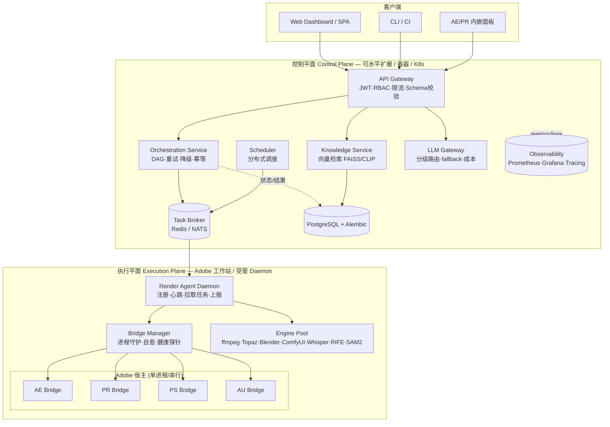

# 后端架构重构 — 目标架构与分阶段执行计划

> 状态：Phase 0 已启动（部分落地） · owner：BackendArchitect · 日期：2026-08-17
> 关联文档：`工具链集成总览.md`、`PHASE10_全项目深度审计报告_2026-07-28.md`、`AE-Bridge避坑指南.md`、`09-计划文件/2026-08-11_24缺陷状态矩阵.md`
> 设计原则：演进式重构，**绝不推倒重写**；尊重"Adobe 必须跑在装了授权的 Windows 单机"这一硬约束。

---

## 一、现状诊断摘要（已核实）

| 维度 | 结论 | 证据 |
|---|---|---|
| 系统本质 | 动漫短视频自动化生产线：15+ 软件引擎 + 多软件知识库 + AI 管线（风格复刻/抠像/3D/字幕） | `🏠-AE知识中心.md` |
| 技术栈 | Python 3.11/3.12 + FastAPI + ExtendScript(JSX) + Node MCP + FAISS/CLIP + SQLAlchemy | `ae/`、`web/`、`pyproject.toml` |
| 部署现实 | **单机 Windows（Administrator）**，Adobe 与 Python 同机；桥接靠人工在 AE 内 `Run Script File` 启动 | `.mcp.json`、`deploy.bat` |
| 桥接层 | `.jsx` 在主线程 `$.sleep(500)` 死循环轮询 `.ae-mcp-bridge/*.json`，**无锁、无认证、全局可变状态** | `media_encoder_mcp_listener.jsx:50`、`ae_command_client.py:221` |
| API 面 | `web/api_server.py` + `web/integrator_api.py` + `knowledge_mcp_server.py` + `fastapi-skeleton` **四套并存，无统一网关** | 各文件 |
| 数据层 | 根 `database.py`（同步 sqlite3 裸 SQL、无迁移）**与** `fastapi-skeleton`（异步 ORM）**两套不连通** | `database.py:626` |
| 基础设施 | compose 仅 backend+nginx；代码预期 Redis/Celery/Postgres 但 compose 一个没起；`--workers 1` + SQLite | `docker-compose.yml`、`puppet-automation/requirements.txt` |
| 安全 | 桥接 HMAC 签名**活跃路径未验签**；`executeScript` 可任意 ExtendScript（RCE）；无 TLS | 见 §四 P0-1 纠偏 |
| 测试/CI | CI 较扎实，但覆盖率门禁形同虚设（`fail_under=60` 从不跑 `--cov`）、pre-commit 未进 CI | `.github/`、`pyproject.toml:197` |

**总体判断**：架构思想先进（分层 Agent、LLM 网关、事件驱动、原子编译器），但**工程落地是"先进骨架 + 沉重最后一公里技术债"**。最大风险不是方向错，而是①控制面/执行面未分离（单机单用户硬撑"分布式"代码意图）②桥接文件轮询伪 MCP 是头号 SPOF ③4 套 API 面/2 套数据层/3 套配置各自为政。

---

## 二、核心约束与设计原则

1. **硬约束**：AE/PR/PS/AU/DaVinci 必须装在有 Adobe 授权的 Windows 工作站，与本地桥接目录强耦合 → **无法容器化**。因此不做"盲目微服务化"。
2. **控制平面 / 执行平面分离**：把"可扩展、可容器化、可多租户"的部分（API、编排、调度、数据、知识、网关）与"必须留在 Adobe 机"的部分（桥接、引擎池）解耦。控制面**永不阻塞在 Adobe 上**。
3. **演进式**：现有系统能真实产出视频，所有改动必须向后兼容、可灰度、可回滚。
4. **Fail-closed 优先**：认证、签名、密钥缺失必须拒绝而非放行（现有 `AE_VAULT_SECRET_KEY` 已示范此模式）。
5. **尊重红线**：`工具链集成总览.md §7A` 禁止修改开源 `after-effects-mcp/src` 与 `mcp-bridge-auto.jsx`；新功能走附加式增强。

---

## 三、目标架构：控制平面 + 执行平面

### 3.1 拓扑

### 3.2 服务分解

| 服务 | 职责 | 技术 | 扩展方式 |
|---|---|---|---|
| API Gateway | 唯一入口：鉴权、RBAC、限流、校验、路由 | FastAPI + Pydantic v2 + Redis 令牌桶 | 多副本 + LB |
| Orchestration | 工作流 DAG、拓扑排序、重试、降级、幂等 | 收敛现有 `workflow_orchestrator` | 无状态横向 |
| Render Agent（执行面） | 工作站注册、拉任务、管桥接生命周期、上报 | Python daemon + nssm/supervisord | 每工作站一个 |
| Bridge Manager | 守护 AE/PR/PS/AU 监听进程，自愈、探针 | supervisord/nssm | 随工作站 |
| Knowledge Service | 接入现有 `knowledge/vector_index_faiss.py`（当前闲置） | FAISS+CLIP + PG 向量 | 无状态 |
| LLM Gateway | 三级档位 + 五级置信度级联 + 降级 + 成本 | 现有 `core/llm_gateway` | 无状态 |
| Task Broker | 队列、死信、延迟、优先级 | Redis + RQ/Celery 或 NATS | 集群 |
| Data Store | 结构化数据 + 媒体元数据 | PostgreSQL + Alembic | 主从/PGPool |

### 3.3 数据模式

- **CQRS 雏形**：写侧（任务/工程/历史）→ PostgreSQL；读侧（知识检索）→ 向量索引；媒体大文件 → 对象存储（MinIO/本地/S3），**绝不进 DB**。
- **单一数据层**：废弃根 `database.py` 同步裸 SQL，统一到 `fastapi-skeleton` 的异步 SQLAlchemy 2.0 + Alembic 迁移。JSON 结果存 **Postgres JSONB**（可索引），而非 TEXT。
- **统一配置**：收敛到 `puppet-automation/src/config/settings.py`（已是 SecretStr + 生产强校验），删除散落的 `.env.doubao`/`.env.bak-*` 与 `core/config.py` 重复键。

### 3.4 安全模型

- 传输层全 TLS（nginx 443 + HSTS）；消灭火明文段隧道。
- 桥接文件通道：OS 文件 ACL（目录不给他人写）+ 不暴露宿主为真实边界（活跃 JSX 不验签，见 §四）。
- 容器非 root、基础镜像 digest 固定、生产镜像剔除 dev 依赖。
- 密钥入 Vault/环境变量，**绝不进仓库**；`.mcp.json` 内 token 移出 URL path，`uvx` 依赖锁定版本（禁 `@main`）。

---

## 四、Phase 0 执行记录（已落地 + 纠偏）

### ✅ 已完成
- **P0-3 修复 compose 生产可用性**：`docker-compose.yml` 注入 fail-closed
  `MCP_AUTH_TOKEN=${MCP_AUTH_TOKEN:?...}`。修复 `main.py:_check_mcp_auth_token` 在 `AEK_ENVIRONMENT=production` 下 token 弱/空即 503 的问题（原 compose 完全未注入）。
- **P0-5 暴露面加固**：`简历投递-公网访问方案.md` 加安全提醒——公网隧道只指静态 8080、禁指 API/桥接目录、禁开防火墙入站、首选 GitHub Pages。核实主指南无危险 `New-NetFirewallRule` 规则。

### 🔑 P0-1 关键纠偏（最有价值的发现）
- 原拟"翻转 `AEK_BRIDGE_SIGNATURE_ENABLED=false` 为 true"——**核实后证明是错误动作**：
  - 活跃 `ae/` 客户端默认 `signature_enabled=True` 且由 secret 是否存在决定；`.mcp_secret` 已非空 → **Python 侧签名本就开着**。
  - 但 grep 证实：**活跃开源 `mcp-bridge-auto.jsx` 未做 HMAC 验签**（验签逻辑只在 `archive/old_jsx/` 与 `au_mcp_bridge.jsx`，且 `archive` 版 HMAC 函数甚至是 `return "dummy"`）。
  - 红线禁止改开源 `after-effects-mcp/src`。
- **结论**：翻转配置键既不被活跃路径消费，又会造成"已加固"的虚假安全感。残余 RCE 风险只能靠 **OS 文件 ACL + 不暴露宿主** 兜底。任务已重新定性。

### ⏸ 暂缓（附理由）
- **P0-4 镜像依赖**：Dockerfile 盲目 `COPY requirements.txt && pip install -r` 会因 `torch==2.3.1+cu121`（需 CUDA 镜像）、`sam2 @ git+...@main`（不可复现+编译依赖）**破坏构建**。正确做法=Phase 1 将重型引擎依赖改为**惰性/可选导入**，使 API 容器无需这些依赖即可启动。本阶段不盲目改。
- **P0-2 双协议收敛**：触及活的 Adobe 设置，需你确认时机（见 §七）。
- **P0-6 CI 覆盖率门禁**：直接开 `fail_under=60` 会让 CI **全红**（当前覆盖近 0）→ 应先非阻塞采集再逐步抬高。
- **P0-7 配置统一**：大重构，非止血项，移入 Phase 1。

---

## 五、Phase 1 控制平面地基设计（详细）

**目标**：统一入口与数据，让控制面可独立扩展、可观测、可测试。

### 5.1 统一 API 网关
- 收敛 `web/api_server.py`(8765)、`web/integrator_api.py`、`knowledge_mcp_server.py` 到**单一 Gateway**（以 `fastapi-skeleton` 分层结构为基准）。
- 中间件顺序：CORS → Helmet 安全头 → JWT 鉴权 → RBAC → **Redis 令牌桶限流**（替换现有进程内内存字典限流）→ Pydantic 请求校验。
- `/metrics` 路由**真实落地**（当前 nginx 代理到不存在的路由 → 恒 404）。

### 5.2 数据层统一
- 选定 `fastapi-skeleton` 的异步 SQLAlchemy 2.0 + `create_async_engine` 模式为唯一数据层。
- 引入 **Alembic** 迁移（当前 `_SCHEMA_VERSION=1` 仅幂等 DDL，无迁移）。
- SQLite 仅用于 dev/embedded；prod 切 Postgres（`config.py:22` 已支持）。
- 结果/元数据 JSON → Postgres **JSONB**（可 GIN 索引），淘汰根 `database.py` 的 TEXT 存储。

### 5.3 配置统一（P0-7）
- 以 `puppet-automation/src/config/settings.py` 为唯一源（SecretStr + 生产强校验）。
- 删除散落键：`core/config.py` 与 `config_schema.py` 的重复定义；`.env.doubao`/`.env.bak-*` 退场。
- 统一键名：例如 `PEXELS_API_KEY` 与 `AEKV_STOCK_PEXELS_API_KEY` 合并为单一。

### 5.4 可观测性接线
- 在 Gateway 暴露真实 `/metrics`（Prometheus 格式）；结构化日志（loguru → 统一字段）。
- 接 Grafana 看板（当前"有埋点无可视化"）。
- 关键 SLI：API P95、任务队列深度、桥接在线率、引擎成功率。

### 5.5 Phase 1 退出标准
- [ ] 单一 Gateway 承载所有 `/api/v1/*`，旧 API 面标记 deprecated 并可并行下线
- [ ] PostgreSQL + Alembic 迁移跑通；两套数据层只剩一套
- [ ] `/metrics` 真实可采；CI 能拉取
- [ ] 限流为 Redis 令牌桶、跨副本生效
- [ ] CI 覆盖率非阻塞采集并出报告（floor 后续抬高）

---

## 六、Phase 2–4 路线图（概要）

| 阶段 | 目标 | 关键交付 | 退出标准 |
|---|---|---|---|
| Phase 2 执行面硬化 | 桥接可靠性（头号风险） | Render Agent + Bridge Manager；桥接加 correlation-id/ack/幂等/熔断/背压；渲染弹窗自动消解 | AE 崩溃后命令不滞留；可自愈 |
| Phase 3 解耦与扩展 | 主从分离 | 控制面→broker→Render Agent 拉模式；多工作站可注册；PG 主从 | 控制面不随 Adobe 宕机 |
| Phase 4 成熟 | AI/可观测/多租户 | Grafana 看板；Knowledge 向量上线；租户隔离；K8s Helm | 99.9% 可用性；10x 峰值可扛 |

---

## 七、P0-2 双协议收敛（风险与方案，待你确认时机）

- **现状**：`AE-Bridge避坑指南.md §2.1/§2.8` 记录 headless（`.ae-mcp-bridge`）与 Documents 面板版两套协议**至今共存竞争**；干扰进程会"复活争写"命令文件，导致自动化卡死。
- **风险**：收敛需停用其一，触及你活的 AE 工作环境——若判断错加载入口，可能让当前能跑的桥接失效。
- **推荐做法（先只读后改）**：
  1. 先产出**只读诊断报告**：列出两个协议的加载入口（`z_mcp_bridge_loader.jsx` / `2_mcp_bridge_listener.jsx` / `ae_mcp_auto_listener.jsx`）、各自写入的桥接目录、冲突点。
  2. 你确认后，仅停用 Documents 面板版加载器，保留 headless 版，并加进程级互斥（文件锁/单例哨兵）防"复活争写"。
  3. 不修改开源 `mcp-bridge-auto.jsx`（红线）。

---

## 八、立即可推进的下一步（建议顺序）

1. **A（推荐先做）**：执行 §七第 1 步——P0-2 只读诊断报告（不改代码，零风险，厘清头号稳定性风险）。
2. **B**：启动 Phase 1.1 统一 API 网关（以 `fastapi-skeleton` 为基准，先加 Redis 限流 + 真实 `/metrics`）。
3. **C**：Phase 1.2 数据层统一（引入 Alembic，SQLite→Postgres 切换）。

> 选 A 可立即开始且零风险；选 B/C 属于较大代码改动，建议先评审本计划再动手。

---

## 附录：关键文件清单（Phase 0/1 涉及）

- 架构/需求：`01-项目概览/`、`03-阶段报告/PHASE10_全项目深度审计报告_2026-07-28.md`、`02-开发文档/开源集成全景分析与架构方案.md`、`工具链集成总览.md`
- 后端代码：`ae/ae_command_client.py`、`ae/ae_bridge_base.py`、`web/api_server.py`、`web/integrator_api.py`、`knowledge_mcp_server.py`、`fastapi-skeleton/`、`core/llm_gateway.py`、`core/security.py`
- 数据/配置：`database.py`、`config_schema.py`、`puppet-automation/src/config/settings.py`、`puppet-automation/src/api/main.py`、`.env.example`、`.mcp_secret`
- 基础设施：`docker-compose.yml`、`Dockerfile`、`nginx/nginx.conf`、`.mcp.json`
- 桥接 JSX：`external/after-effects-mcp/src/scripts/mcp-bridge-auto.jsx`、`au_mcp_bridge.jsx`、`archive/old_jsx/`（验签参考）、`AE-Bridge避坑指南.md`
